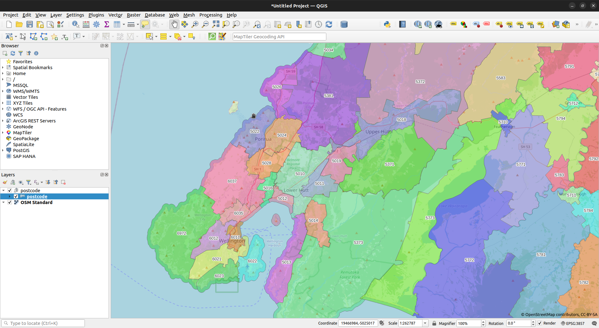

# New Zealand Postcodes

This repo primarily contains a simple R script, `nz_postcode.R`, which fetches the postcode information for New Zealand via an [ArcGIS feature service](https://services2.arcgis.com/JCZKHUOTKN7eWpNb/arcgis/rest/services/APF_POSTCODES/FeatureServer/).  For convenience, and for non-R programmers, the code can be run using Docker Compose:

```bash
mkdir -p data
docker compose -f postcodegpkg.yml up -d
```

When complete, and if all has gone well, a single geopackage will be output in `data/postcode.gpkg`.



Note that users of desktop GIS systems such as QGIS can load the the ArcGIS feature service directly.


## Extensions

There are a number of interesting things we can do once we have postcodes in a single feature class, and the repo contains code for a couple of scenarios:

* attach postcode to [LINZ street addresses](https://data.linz.govt.nz/layer/53353-nz-street-address/)
* attach postcode to low-level geographies, such as [Statistical Area 2](https://datafinder.stats.govt.nz/layer/106706-statistical-area-2-2022-clipped-generalised/)
* attach higher geography codes, such as [Territorial Authority](https://datafinder.stats.govt.nz/layer/106669-territorial-authority-2022-clipped-generalised/) or [suburbs and localities](https://data.linz.govt.nz/layer/110443-nz-suburbs-and-localities-pilot/), to postcode

### PostGIS!

Interesting things will often require us to conduct a spatial join.  A good way of doing this is to load feature classes to a PostGIS-enabled database, and then use spatial queries.  We can get a usable database using Docker easily enough, and a sufficient instance is provided here.  Simply run:

```bash
docker compose -f postgis.yml up -d
```

This will result in a docker image called `postgis` being created, and an instance created.  Data loaded to the instance will be persisted in a volume called `postgisdata`, so we need only load it once.  **Assuming we have all the required data saved in the folder `data` ahead of time**, this can be done by running:

```r
library(sf)
library(dplyr)

# postcode ---------------------------------------------------------------------
postcode <- st_read("data/postcode.gpkg") |>
  st_transform(2193) |>
  mutate(description = code) |>
  select(code, description)

# meshblock --------------------------------------------------------------------
# to be uniform, lets just repeat the code as the mb description
mb <- st_read("data/meshblock-2022-clipped-generalised.gpkg") |>
  st_transform(2193) |>
  rename(code = MB2022_V1_00) |>
  mutate(description = code) |>
  select(code, description)

# suburb -----------------------------------------------------------------------
suburb <- st_read("data/nz-suburbs-and-localities-pilot.gpkg") |>
  st_transform(2193) |>
  mutate(
    code = suburb_locality_ascii,
    description = suburb_locality
  ) |>
  select(
    code, description,
    suburb_locality, additional_name, type, major_name, major_name_type
  )

# area unit --------------------------------------------------------------------
au <- st_read("data/area-unit-2013.gpkg") |>
  st_transform(2193) |>
  rename(code = AU2013_V1_00, description = AU2013_V1_00_NAME) |>
  select(code, description)

# sa2 --------------------------------------------------------------------------
sa2 <- st_read("data/statistical-area-2-2022-clipped-generalised.gpkg") |>
  st_transform(2193) |>
  rename(code = SA22022_V1_00, description = SA22022_V1_00_NAME) |>
  select(code, description)

# ta ---------------------------------------------------------------------------
ta <- st_read("data/territorial-authority-2022-clipped-generalised.gpkg") |>
  st_transform(2193) |>
  rename(code = TA2022_V1_00, description = TA2022_V1_00_NAME) |>
  select(code, description)

# regional council -------------------------------------------------------------
rc <- st_read("data/regional-council-2022-clipped-generalised.gpkg") |>
  st_transform(2193) |>
  rename(code = REGC2022_V1_00, description = REGC2022_V1_00_NAME) |>
  select(code, description)

# address ----------------------------------------------------------------------
addr <- st_read("data/nz-street-address.gpkg") |>
  st_transform(2193)

colnames(addr) <- tolower(colnames(addr))

# load to postgis --------------------------------------------------------------
conn <- RPostgreSQL::dbConnect(
  "PostgreSQL", host = "localhost", port = 5432,
  dbname = "gis", user = "gisuser", password = "gisuser"
)

st_write(postcode, conn, c("public", "postcode"))
st_write(mb, conn, c("public", "mb"))
st_write(suburb, conn, c("public", "suburb"))
st_write(au, conn, c("public", "au"))
st_write(sa2, conn, c("public", "sa2"))
st_write(ta, conn, c("public", "ta"))
st_write(rc, conn, c("public", "rc"))
st_write(addr, conn, c("public", "address"))

DBI::dbSendQuery(
  conn,
  '
  CREATE INDEX postcode_idx
  ON postcode
  USING GIST (geom);
  '
)

DBI::dbSendQuery(
  conn,
  '
  CREATE INDEX mb_idx
  ON mb
  USING GIST (geom);
  '
)

DBI::dbSendQuery(
  conn,
  '
  CREATE INDEX suburb_idx
  ON suburb
  USING GIST (geom);
  '
)

DBI::dbSendQuery(
  conn,
  '
  CREATE INDEX au_idx
  ON au
  USING GIST (geom);
  '
)

DBI::dbSendQuery(
  conn,
  '
  CREATE INDEX sa2_idx
  ON sa2
  USING GIST (geom);
  '
)

DBI::dbSendQuery(
  conn,
  '
  CREATE INDEX ta_idx
  ON ta
  USING GIST (geom);
  '
)

DBI::dbSendQuery(
  conn,
  '
  CREATE INDEX rc_idx
  ON rc
  USING GIST (geom);
  '
)

DBI::dbSendQuery(
  conn,
  '
  CREATE INDEX addr_idx
  ON address
  USING GIST (geom);
  '
)

# tidy up ----------------------------------------------------------------------
DBI::dbDisconnect(conn)
rm(list = ls())
```

## Attach postcode to LINZ addresses

This is quite straightforward.  Simply run something the following query:

```sql
select
  a.address_id, a.full_address, b.code as postcode,
  ST_X(a.geom) as x, ST_Y(a.geom) as y,
  ST_X(ST_TRANSFORM(a.geom, 4326)) as lng,
  ST_Y(ST_TRANSFORM(a.geom, 4326)) as lat
from
  address a
left outer join
  postcode b
on
  ST_CONTAINS(b.geom, a.geom)
```

The first 5 rows, for example, look as follows:

| address_id|full_address                                |postcode |       x|       y|      lng|       lat|
|----------:|:-------------------------------------------|:--------|-------:|-------:|--------:|---------:|
|     187945|16C Tralee Place, Bishopdale, Christchurch  |8053     | 1567101| 5185163| 172.5931| -43.48573|
|     190399|21A Hamilton Avenue, Ilam, Christchurch     |8041     | 1566644| 5181334| 172.5873| -43.52018|
|     194441|86B Claridges Road, Casebrook, Christchurch |8051     | 1567419| 5186446| 172.5972| -43.47419|
|     197303|30A Blighs Road, Strowan, Christchurch      |8052     | 1567735| 5182956| 172.6009| -43.50563|
|     197684|79A Jeffreys Road, Fendalton, Christchurch  |8052     | 1567735| 5182328| 172.6008| -43.51129|


## Attaching postcode to low-level geographies

Consider the [New Zealand Suburbs and Localities](https://data.linz.govt.nz/layer/110443-nz-suburbs-and-localities-pilot/) feature set provided by LINZ.  There are several ways we could go about attaching a postcode that would work well enough.  We could find the centroid for each suburb, and then determine which postcode the centroid lies in.  This is probably the simplest approach, but it does have some issues.  We could do a full intersection, and decide that a postcode we assign to a geography is the one that covers the greatest area.  This could be done as follows:

```sql
with grp as
  (
    select
      *, rank() over (partition by suburb_code order by area desc) rn
    from
    (
      select
        a.code as suburb, b.code as postcode, 
        ST_CENTROID(a.geom) as xy,
        ST_AREA(ST_INTERSECTION(a.geom, b.geom)) as area
      from
        suburb a
      inner join
        postcode b
      on
        ST_INTERSECTS(a.geom, b.geom)
    ) c
  )
select
  suburb_code, suburb_description, postcode,
  ST_X(xy) as x, ST_Y(xy) as y,
  ST_X(ST_TRANSFORM(xy, 4326)) as lng, ST_Y(ST_TRANSFORM(xy, 4326)) as lat
from
  grp
where
  rn = 1
```

For example, the entries for postcode 5018 are as follows:

|suburb              |postcode |       x|       y|      lng|       lat|
|:-------------------|:--------|-------:|-------:|--------:|---------:|
|Birchville          |5018     | 1777096| 5448933| 175.1086| -41.09159|
|Brown Owl           |5018     | 1776135| 5447585| 175.0975| -41.10394|
|Clouston Park       |5018     | 1775170| 5446144| 175.0865| -41.11711|
|Ebdentown           |5018     | 1773902| 5446024| 175.0714| -41.11847|
|Elderslea           |5018     | 1772768| 5445865| 175.0580| -41.12014|
|Heretaunga          |5018     | 1769373| 5443917| 175.0181| -41.13840|
|Kingsley Heights    |5018     | 1774967| 5445257| 175.0843| -41.12515|
|Maidstone           |5018     | 1773986| 5444810| 175.0728| -41.12938|
|Maoribank           |5018     | 1776326| 5446759| 175.1001| -41.11133|
|Maymorn             |5018     | 1778752| 5446824| 175.1289| -41.11021|
|Riverstone Terraces |5018     | 1771102| 5446849| 175.0379| -41.11163|
|Te Marua            |5018     | 1779644| 5449197| 175.1388| -41.08865|
|Timberlea           |5018     | 1777538| 5447637| 175.1142| -41.10316|
|Trentham            |5018     | 1771387| 5443462| 175.0422| -41.14207|
|Upper Hutt Central  |5018     | 1773718| 5445418| 175.0694| -41.12397|
|Wallaceville        |5018     | 1773298| 5444374| 175.0647| -41.13345|

## Attach higher geographies to postcode

Consider the example of [Regional Council](https://datafinder.stats.govt.nz/layer/106667-regional-council-2022-clipped-generalised/).  As before, we can go about attaching this to each postcode in several ways.  If each postcode lies entirely within a single region, this can be done by a simple intersection.  Here, the topologies aren't in perfect alignment, so best results are still gotten by considering which region _most_ of a postcode lies in (even if it's 99.99% in practice).  For example:

```sql
with grp as
  (
    select
      *, rank() over (partition by postcode order by area desc) rn
    from
    (
      select
        a.code as postcode, b.code as region, b.description as region_name,
        ST_AREA(ST_INTERSECTION(a.geom, b.geom)) as area
      from
        postcode a
      inner join
        rc b
      on
        ST_INTERSECTS(a.geom, b.geom)
    ) c
  )
select
  postcode, region, region_name
from
  grp
where
  rn = 1
```

For example, 10 randomly selected rows:

|postcode |region |region_name               |
|:--------|:------|:-------------------------|
|4696     |08     |Manawatū-Whanganui Region |
|0875     |02     |Auckland Region           |
|4120     |06     |Hawke's Bay Region        |
|7884     |12     |West Coast Region         |
|7882     |12     |West Coast Region         |
|4930     |08     |Manawatū-Whanganui Region |
|4477     |08     |Manawatū-Whanganui Region |
|7178     |18     |Marlborough Region        |
|3282     |03     |Waikato Region            |
|3177     |04     |Bay of Plenty Region      |

